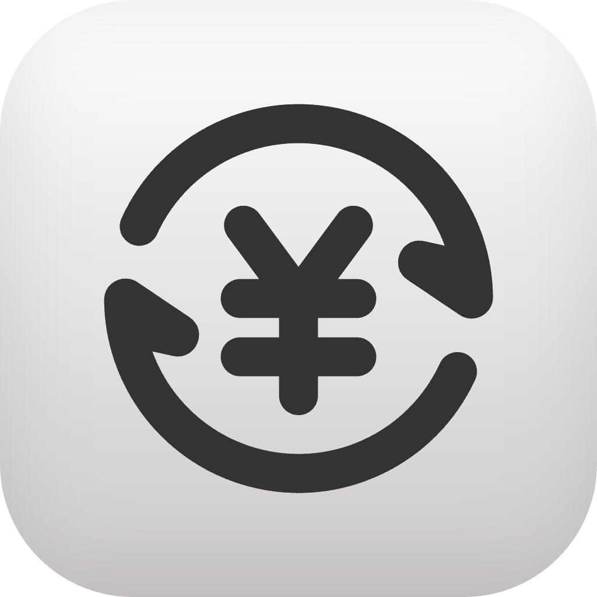

<p align="center">
  
</p>

<h1 align="center">CurrencySpot</h1>

<p align="center">
  A simple, private, and powerful currency converter for iOS.
</p>

<p align="center">
  <a href="https://apps.apple.com/us/app/currencyspot/id6752545989">
    
  </a>
</p>

---

## Features

**Real-time conversion** between 30 currencies using European Central Bank rates.

**Historical charts** showing exchange rate trends over the past week, month, or year.

**Works offline** with cached rates when you don't have internet.

**No tracking, no ads.** Your data stays on your device.

## Building from Source

```bash
git clone https://github.com/dingzeyu1029/CurrencySpot.git
cd CurrencySpot
cp CurrencySpot.xcconfig.template CurrencySpot.xcconfig
```

Open `CurrencySpot.xcconfig` and add your details:

```
DEVELOPMENT_TEAM = ABC123XYZ   // Your Team ID from developer.apple.com
BUNDLE_ID_PREFIX = com.example // Your reverse domain prefix
```

Then link the config file in Xcode:

1. Open the project in Xcode
2. Select the **CurrencySpot** project (blue icon) in the navigator
3. Go to **Info** tab → **Configurations**
4. For both Debug and Release, set the configuration file to `CurrencySpot.xcconfig`

Now you can build and run.

## Credits

Exchange rates provided by the [European Central Bank](https://www.ecb.europa.eu/) via [Frankfurter API](https://www.frankfurter.app/).

## License

GPL-3.0 License. See [LICENSE](LICENSE) for details.
